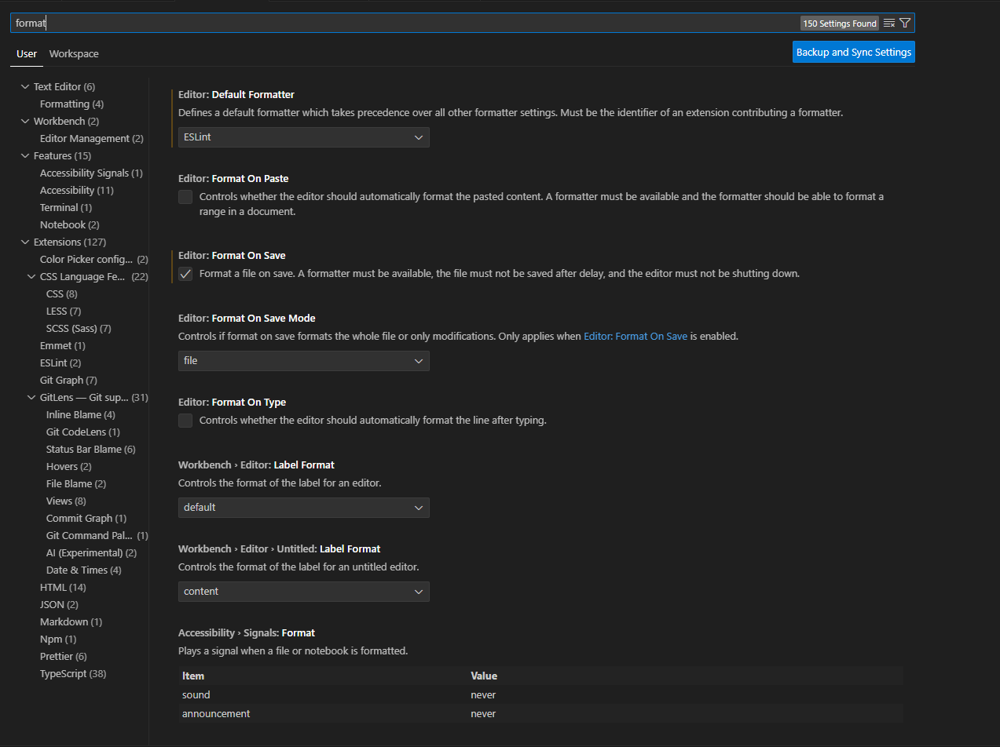
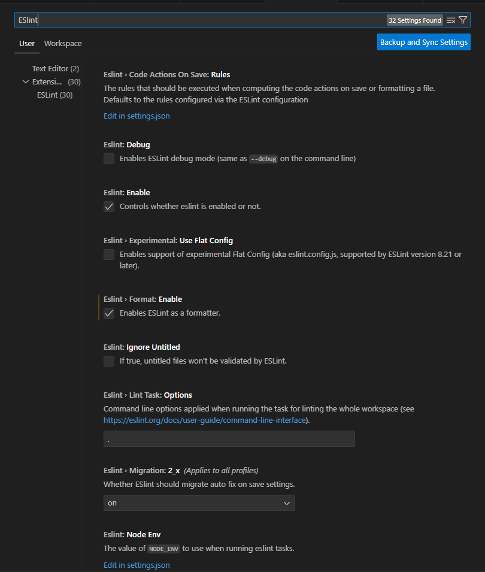
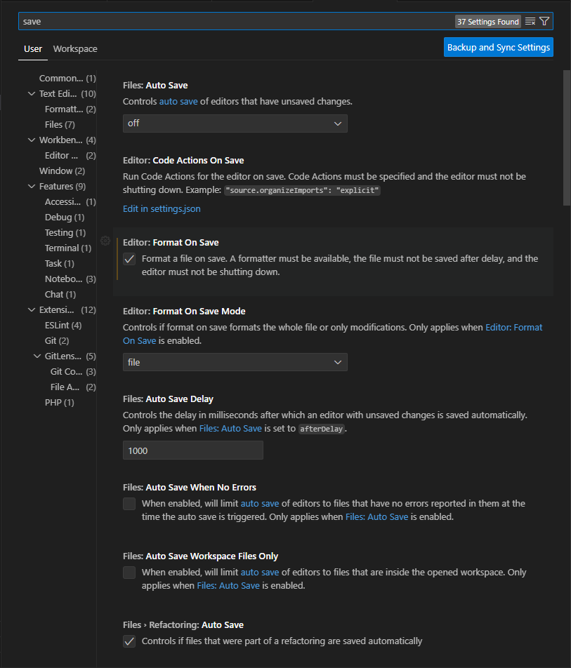

### Project setup

1. Setup the extensions

2. Go to Keyboard Shortcuts (File -> Preferences -> Keyboard Shortcuts)

3. Change "File: Save" keybind to CTRL+SHIFT+S

4. Change "File: Save All Files" keybind to CTRL+S (`you should use this one to save files`)

5. Remove any Save keybind that interferes with this ones

6. Go to Settings (File -> Preferences -> Settings) and put the same settings like in the following picture

7. Enable ESlint like the picture

8. Enable saving options
